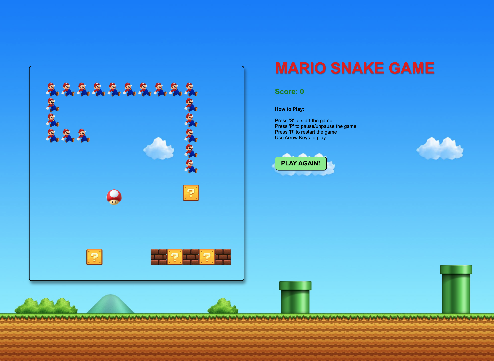

# Mario Themed Snake Game

This is a simple browser-based version of the original snake video game with a Super Mario Twist! This was built over 2 days for fun using Object Oriented Programming and vanilla JavaScript.

## Getting Started

1. Clone or download the repo
2. Open `index.html` in your browser of choice \*
3. Press `S` to start game play and `P` to pause/unpause the game.
4. Use the arrow keys on your keyboard to move Mario towards the mushroom
5. Press `R` or `Play Again` to restart the game.

\*Audio currently only autoplays in Safari.

## Future Features

- [ ] Autoplay Audio in Chrome
- [ ] Fix Scoreboard
